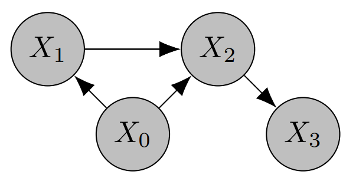
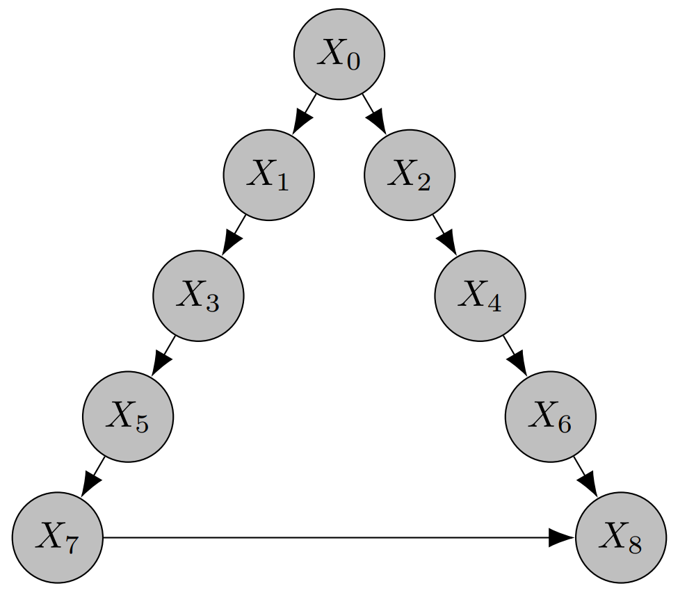
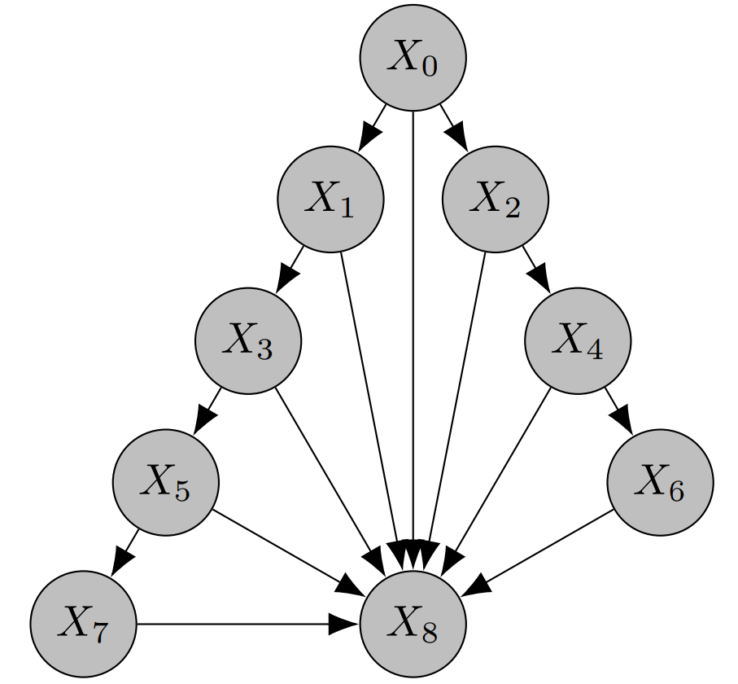
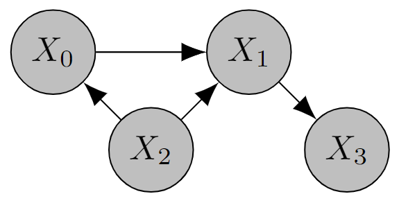

# CSuite: A Suite of Benchmark Datasets for Causality

CSuite is a collection of synthetic datasets for benchmarking causal machine learning algorithms. Each dataset consists of
 - the true causal graph, for benchmarking causal discovery;
 - 4000 rows of observational training data;
 - 2000 rows of observational test data;
 - interventional test data, for benchmarking estimation of average treatment effect (ATE) and conditional average treatment effect (CATE), 2000 rows per interventional environment.
 
The data was generated from known hand-crafted structural equation models (SEMs). Different datasets are intended to test different features of causal discovery and inference algorithms. CSuite was originally introduced in [this paper](https://arxiv.org/pdf/2202.02195.pdf). The [data generation code for CSuite](https://github.com/microsoft/causica/blob/main/causica/data_generation/csuite/simulate.py) is publicly available.

## Versioning
CSuite datasets are versioned so that we can amend and add datasets, whilst ensuring backwards compatibility with older versions of the data. Full reproducibility with CSuite requires specifying the correct version.

## Summary of datasets

|  Dataset | No. nodes  | No. edges  | Additive noise model?  |  Discrete/continuous | ATE benchmarking |  CATE benchmarking | Download link |
| :------------ | :------------ | :------------ | :------------ | :------------ |:------------ |:------------ |:------------ |
| lingauss  | 2  | 1  | Y  | Continuous  | Y | N | https://azuastoragepublic.blob.core.windows.net/datasets/csuite_lingauss/data.zip |
| linexp  | 2  | 1 | Y  | Continuous  | Y | N | https://azuastoragepublic.blob.core.windows.net/datasets/csuite_linexp/data.zip |
| nonlingauss  | 2  | 1  | Y  | Continuous  | Y | N | https://azuastoragepublic.blob.core.windows.net/datasets/csuite_nonlingauss/data.zip |
| nonlin_simpson  | 4  | 4  | Y  | Continuous  | Y | Y | https://azuastoragepublic.blob.core.windows.net/datasets/csuite_nonlin_simpson/data.zip |
| symprod_simpson  | 4  |  4 | Y   |  Continuous | Y | Y | https://azuastoragepublic.blob.core.windows.net/datasets/csuite_symprod_simpson/data.zip |
| large_backdoor  | 9  | 10  | Y  | Continuous  | Y | Y | https://azuastoragepublic.blob.core.windows.net/datasets/csuite_backdoor/data.zip |
| weak_arrows  | 9  | 15  | Y  |  Continuous  | Y | N | https://azuastoragepublic.blob.core.windows.net/datasets/csuite_weak_arrows/data.zip |
| cat_to_cts  | 2  | 1  | N  | Mixed  | Y | N | https://azuastoragepublic.blob.core.windows.net/datasets/csuite_cat_to_cts/data.zip |
| cts_to_cat  | 2  | 1  | N  | Mixed  | Y | N | https://azuastoragepublic.blob.core.windows.net/datasets/csuite_cts_to_cat/data.zip |
| mixed_simpson  | 4  |4  | N  | Mixed  | Y | N | https://azuastoragepublic.blob.core.windows.net/datasets/csuite_mixed_simpson/data.zip |
| large_backdoor_binary_t  | 9  | 10  | N  | Mixed  | Y | Y | https://azuastoragepublic.blob.core.windows.net/datasets/csuite_large_backdoor_binary_t/data.zip |
| weak_arrows_binart_t  | 9  | 15  | N  | Mixed  | Y | N | https://azuastoragepublic.blob.core.windows.net/datasets/csuite_weak_arrows_binary_t/data.zip |
| mixed_confounding  | 12  | 15  | N  | Mixed  | Y | N | https://azuastoragepublic.blob.core.windows.net/datasets/csuite_mixed_confounding/data.zip |
| cat_chain  | 3  | 2  | N  | Discrete  | Y | N | https://azuastoragepublic.blob.core.windows.net/datasets/csuite_cat_chain/data.zip |
| cat_collider  | 3  | 2  | N  | Discrete  | Y | N | https://azuastoragepublic.blob.core.windows.net/datasets/csuite_cat_collider/data.zip |


## Data format

Each dataset consists of the following files
 - `adj_matrix.csv`, which describes the causal graph used to generate the data; a value `1` in row `i`, column `j` indicates an edge from node `i` to node `j`;
 - `train.csv`, the observational training data;
 - `test.csv`, the observational test data;
 - `interventions.json`, a JSON containing interventional test data.

The interventional data JSON consists of *pairs* of interventional environments, which can be used to estimate (C)ATE. The two environments are the 'primary' and 'reference' environments. Conditional data was generating using HMC. The format of the interventional data is

```
{
    "environments": [
        {
            "conditioning_idxs": <optional list containing indices of nodes to that were conditioned on>,
            "conditioning_values": <list of values set on the conditioning nodes>,
            "effect_idxs": <list containing indices of nodes to be considered effect variables>,
            "intervention_idxs": <list of indices of nodes that were acted on with do-intervention>,
            "intervention_values": <list of values set on the intervention nodes in the primary do-intervention: for example, receiving a medicine>,
            "intervention_reference": <list of values set on the intervention nodes in the reference do-intervention: for example, not receiving the medicine>,
            "test_data": <array of data from the primary do-intervention, same number of columns as train.csv>,
            "reference_data": <array of data from the reference do-intervention>
        },
        ...
    ],
    "metadata": {
        "columns_to_nodes": <matches to columns to their corresponding nodes, only important for vector-values nodes>
    }
}
```

## Download

### From the terminal

You can download CSuite datasets using the following URL pattern
```
$ curl -O https://azuastoragepublic.blob.core.windows.net/datasets/csuite_<name>/data.zip
```

### From Python

The uncompressed files listed under [Data format](#data-format) are also directly available from the same location as the zip files. These may either be accessed through their HTTP links, replacing `data.zip` with the target file, e.g. https://azuastoragepublic.blob.core.windows.net/datasets/csuite_linexp/train.csv or their equivalent azure blob storage paths. To load these directly in python:

```python
import pandas as pd

# Load over HTTP
df = pd.read_csv("https://azuastoragepublic.blob.core.windows.net/datasets/csuite_linexp/train.csv")

# Load using `adlfs` (`pip install adlfs`)
df = pd.read_csv("az://datasets@azuastoragepublic.blob.core.windows.net/csuite_linexp/train.csv")
```

## Citation
If you use CSuite datasets in your work, please cite the following [paper](https://arxiv.org/pdf/2202.02195.pdf) which originally introduced these datasets
```
@article{geffner2022deep,
    title={Deep End-to-end Causal Inference},
    author={Geffner, Tomas and Antoran, Javier and Foster, Adam and Gong, Wenbo and Ma, Chao and Kiciman, Emre and Sharma, Amit and Lamb, Angus and Kukla, Martin and Pawlowski, Nick and  Allamanis, Miltiadis and Zhang, Cheng},
    journal={arXiv preprint arXiv:2202.02195},
    year={2022}
}
```

## Detailed descriptions of datasets

### lingauss

 X1" width="250px" />

A two node linear Gaussian system. The structural equations are

$$
\begin{align}
X_0 &\sim N(0, 1) \\
X_1 &= \frac{1}{2}X_0 + \frac{\sqrt{3}}{2}Z_1
\end{align}
$$

where $Z_1 \sim N(0,1)$ is independent of $X_0$. The dataset is constructed so that the observational distribution is the same if $X_0$ and $X_1$ are swapped and both nodes have the same marginal variance of 1. This model is not structural identifiable from observational data.


### linexp

 X1" width="250px" />

A two node linear system with exponentially distributed noise. The structural equations are

$$
\begin{align}
X_0 &= Z_0 - 1 \\
X_1 &= \frac{1}{2}X_0 + \frac{\sqrt{3}}{2}(Z_1-1)
\end{align}
$$

where $Z_0, Z_1 \sim \textup{Exp}(1)$ are independent variables. The dataset is constructed so that both nodes have the same marginal variance of 1. This model is structural identifiable given a non-Gaussian additive noise assumption.


### nonlingauss

 X1" width="250px" />

A two node non-linear system with Gaussian distributed noise. The structural equations are

$$
\begin{align}
X_0 &\sim N(0,1) \\
X_1 &=  \sqrt{6} \exp(-X_0^2) + \alpha Z_1
\end{align}
$$

where $Z_1 \sim N(0,1)$ is independent of $X_0$ and 

$$
\alpha^2 = 1 - 6 \left(\frac{1}{\sqrt{5}} - \frac{1}{3} \right).
$$

The dataset is constructed so that $\textup{Var}(X_0) = \textup{Var}(X_1) = 1$ and $\textup{Cov}(X_0,X_1)=0$. This model is structural identifiable given a nonlinear additive noise assumption.

### nonlin_simpson

 X1, X0 -> X2, X1 -> X2, X2 -> X3" width="300px" />

An example of [Simpson's Paradox](https://en.wikipedia.org/wiki/Simpson's_paradox) using a continuous SEM. The dataset is constructed so that $\textup{Cov}(X_1,X_2)$ has the opposite sign to $\textup{Cov}(X_1,X_2\mid X_0)$. Estimating the treatment effects correctly in this SEM is highly sensitive to accurate causal discovery.

The structural equations are

$$
\begin{align}
X_0 &\sim N(0,1) \\
X_1 &= s(1 - X_0) + \sqrt{\frac{3}{20}} Z_1\\
X_2 &= \tanh(2X_1) + \frac{3}{2}X_0 -1 + \tanh(Z_2)\\
X_3 &= 5 \tanh\left(\frac{X_2 - 4}{5}\right) + 3 + \frac{1}{\sqrt{10}} Z_3
\end{align}
$$

where $Z_1,Z_2 \sim N(0,1)$ and $Z_3 \sim \textup{Laplace}(1)$ are mutually independent and independent of $X_0$, $s(x) = \log(1+\exp(x))$ is the softplus function. Constants were chosen so that each variable has a marginal variance of (approximately) 1.  

### symprod_simpson

 X1, X0 -> X2, X1 -> X2, X2 -> X3" width="300px" />

A dataset exhibiting multi-modality that is suitable for benchmarking CATE estimation. Nonlinear function estimation is important since $\textup{Cov}(X_0,X_2)=\textup{Cov}(X_1,X_2)=0$.

The structural equations are

$$
\begin{align}
X_0 &\sim N(0,1) \\
X_1 &= 2\tanh(2X_0) + \frac{1}{\sqrt{10}} Z_1\\
X_2 &= \frac{1}{2}X_0 X_1 + \frac{1}{\sqrt{2}} Z_2\\
X_3 &= \tanh\left(\frac{3}{2}  X_0\right) + \sqrt{\frac{3}{10}} Z_3
\end{align}
$$

where $Z_1 \sim t_3,Z_2 \sim \textup{Laplace}(1)$ and $Z_3 \sim N(0,1)$ are mutually independent and independent of $X_0$. Constants were chosen so that each variable has a marginal variance of (approximately) 1.  

### large_backdoor



A larger dataset with a pyramidal graph structure. This dataset is constructed so that there are many possible choices of backdoor adjustment set for estimating the treatment effect of $X_7$ on $X_8$. While both minimal and maximal adjustment sets can result in a correct solution, the a minimal adjustment set results in a much lower-dimensional adjustment problem and thus will result in lower variance solutions.

A complete description of the structural equations can be found in the [data generation code for CSuite](https://github.com/microsoft/causica/blob/main/causica/data_generation/csuite/simulate.py).

### weak_arrows



A larger dataset that is similar to `large_backdoor`, but with many additional edges. The causal discovery challenge revolves
around finding all arrows, which are scaled to be relatively weak, but which have significant predictive power for $X_8$ in aggregate.

A complete description of the structural equations can be found in the [data generation code for CSuite](https://github.com/microsoft/causica/blob/main/causica/data_generation/csuite/simulate.py).


### cat_to_cts

 X1" width="250px" />

| Variable  | Discrete/continuous |
| ------------ | ------------ |
|  $X_0$ | Discrete on $\\{0,1,2\\}$ |
|  $X_1$ | Continuous  |


A two node system with one categorical and one continuous variable. The structural equations are

$$
\begin{align}
X_0 &\sim \text{Cat}\left(\frac{1}{4}, \frac{1}{4}, \frac{1}{2}\right)\\
X_1 &= \frac{1}{2}(X_0-1) + \frac{9}{25}\mathbf{1}_{\\{X_1=2\\}} + \frac{8}{5}(s(Z_1) - 1)
\end{align}
$$

where $s(x) = \log(1+\exp(x))$ is the softplus function, and $Z_1 \sim N(0,1)$ is independent of $X_0$. 

### cts_to_cat

 X1" width="250px" />


| Variable  | Discrete/continuous |
| ------------ | ------------ |
|  $X_0$ | Continuous |
|  $X_1$ | Discrete on $\\{0,1,2\\}$  |

A two node system with one categorical and one continuous variable. The structural equations are

$$
\begin{align}
    X_0 &\sim U(-\sqrt{3},\sqrt{3})\\
    p(X_1|X_0=x) &= \begin{cases}
    \left(\tfrac{6}{13},\tfrac{6}{13},\tfrac{1}{13} \right) & \text{ if } x < -\tfrac{\sqrt{3}}{3} \\
    \left(\tfrac{1}{8},\tfrac{3}{4},\tfrac{1}{8} \right) & \text{ if } -\tfrac{\sqrt{3}}{3} \le x < \tfrac{\sqrt{3}}{3} \\
    \left(\tfrac{1}{3},\tfrac{1}{3},\tfrac{1}{3} \right) & \text{ if } x > \tfrac{\sqrt{3}}{3} \\
    \end{cases}
\end{align}
$$

### mixed_simpson

 X0, X2 -> X1, X0 -> X1, X1 -> X3" width="300px" />


| Variable  | Discrete/continuous |
| ------------ | ------------ |
|  $X_0$ | Discrete on $\\{0,1\\}$  |
|  $X_1$ | Continuous  |
|  $X_2$ | Discrete on $\\{0,1,2,3,4,5\\}$ |
|  $X_3$ | Continuous  |


Another example of [Simpson's Paradox](https://en.wikipedia.org/wiki/Simpson's_paradox) using a mixed-type SEM. The dataset is constructed so that $\textup{Cov}(X_0,X_1)$ has the opposite sign to $\textup{Cov}(X_0,X_1\mid X_2)$. Estimating the treatment effects correctly in this SEM is highly sensitive to accurate causal discovery.

The structural equations are

$$
\begin{align}
X_2 &\sim \text{Cat}\left(\frac{1}{6},\frac{1}{6},\frac{1}{6},\frac{1}{6},\frac{1}{6},\frac{1}{6}\right) \\
p(X_0|X_2=x)  &= \begin{cases}
    \left(\tfrac{1}{12},\tfrac{11}{12} \right) & \text{ if } x < 3 \\
    \left(\tfrac{11}{12},\tfrac{1}{12} \right) & \text{ if } x \ge 3 \\
    \end{cases} \\
X_1 &= \frac{7}{10}\left(X_0 + X_2 - 4\right) + s\left(\frac{1}{2}  Z_1 \right) \\
X_3 &= \frac{10}{3} \tanh\left(\frac{X_1}{3}\right) + \frac{1}{10}(Z_3 -1)
\end{align}
$$

where $Z_1 \sim N(0,1),Z_3\sim \textup{Exp}(1)$ are independent noise random variables and $s(x)=\log(1+\exp(x))$.

### large_backdoor_binary_t


| Variable  | Discrete/continuous |
| ------------ | ------------ |
|  $X_0$ | Continuous  |
|  $X_1$ | Continuous  |
|  $X_2$ | Continuous  |
|  $X_3$ | Continuous  |
|  $X_4$ | Continuous  |
|  $X_5$ | Continuous  |
|  $X_6$ | Continuous  |
|  $X_7$ | Discrete on $\\{0,1\\}$ |
|  $X_8$ | Continuous  |

An adaptation of `large_backdoor` with a binary variable $X_7$ which is considered the treatment variable.

A complete description of the structural equations can be found in the [data generation code for CSuite](https://github.com/microsoft/causica/blob/main/causica/data_generation/csuite/simulate.py).

### weak_arrow_binary_t


| Variable  | Discrete/continuous |
| ------------ | ------------ |
|  $X_0$ | Continuous  |
|  $X_1$ | Continuous  |
|  $X_2$ | Continuous  |
|  $X_3$ | Continuous  |
|  $X_4$ | Continuous  |
|  $X_5$ | Continuous  |
|  $X_6$ | Continuous  |
|  $X_7$ | Discrete on $\\{0,1\\}$ |
|  $X_8$ | Continuous  |

An adaptation of `weak_arrows` with a binary variable $X_7$ which is considered the treatment variable.

A complete description of the structural equations can be found in the [data generation code for CSuite](https://github.com/microsoft/causica/blob/main/causica/data_generation/csuite/simulate.py).

### mixed_confounding


| Variable  | Discrete/continuous |
| ------------ | ------------ |
|  $X_0$ | Discrete on $\\{0,1\\}$  |
|  $X_1$ | Continuous  |
|  $X_2$ | Continuous  |
|  $X_3$ | Continuous  |
|  $X_4$ | Discrete on $\\{0,1\\}$  |
|  $X_5$ | Discrete on $\\{0,1,2\\}$  |
|  $X_6$ | Continuous  |
|  $X_7$ | Discrete on $\\{0,1,2\\}$ |
|  $X_8$ | Continuous  |
|  $X_9$ | Continuous  |
|  $X_{10}$ | Continuous  |
|  $X_{11}$ | Continuous  |


A larger dataset with treatment node $X_0$ and outcome node $X_1$. There are different variables that are: confounders, causes of $X_0$ only, causes of $X_1$ only, downstream of $X_0$, downstream of $X_1$, collider caused by $X_0$ and $X_1$.

A complete description of the structural equations can be found in the [data generation code for CSuite](https://github.com/microsoft/causica/blob/main/causica/data_generation/csuite/simulate.py).


### cat_chain

X1->X2" width="400px" />

| Variable  | Discrete/continuous |
| ------------ | ------------ |
|  $X_0$ | Discrete on $\\{0,1,2\\}$  |
|  $X_1$ | Discrete on $\\{0,1,2\\}$  |
|  $X_2$ | Discrete on $\\{0,1\\}$ |

A chain graph with discrete variables. The structural equations are 

$$
\begin{align}
X_0 &\sim \text{Cat}\left(\frac{1}{4}, \frac{1}{4}, \frac{1}{2}\right)\\
p(X_1|X_0=x) &= \begin{cases}
    \left(\tfrac{3}{4},\tfrac{1}{8},\tfrac{1}{8} \right) & \text{ if } x=0 \\
    \left(\tfrac{1}{8},\tfrac{3}{4},\tfrac{1}{8} \right) & \text{ if } x=1 \\
    \left(\tfrac{1}{8},\tfrac{1}{8},\tfrac{3}{4} \right) & \text{ if } x=2 \\
    \end{cases} \\
p(X_2|X_1=y) &= \begin{cases}
    \left(\tfrac{6}{7},\tfrac{1}{7} \right) & \text{ if } y=0 \\
    \left(\tfrac{6}{7},\tfrac{1}{7} \right) & \text{ if } y=1 \\
    \left(\tfrac{1}{7},\tfrac{6}{7} \right) & \text{ if } y=2. \\
    \end{cases} \\
\end{align}
$$


### cat_collider

X1<-X2" width="400px" />

| Variable  | Discrete/continuous |
| ------------ | ------------ |
|  $X_0$ | Discrete on $\\{0,1,2\\}$  |
|  $X_1$ | Discrete on $\\{0,1,2\\}$  |
|  $X_2$ | Discrete on $\\{0,1\\}$ |

A collider graph with discrete variables. The structural equations are

$$
\begin{align}
X_0 &\sim \text{Cat}\left(\frac{1}{4}, \frac{1}{4}, \frac{1}{2}\right)\\
X_2 &\sim \text{Cat}\left(\frac{1}{2}, \frac{1}{2}\right) \\
p(X_1|X_0=x,X_1=y) &= \begin{cases}
    \left(\tfrac{11}{13},\tfrac{1}{13},\tfrac{1}{13} \right) & \text{ if } x=0,y=0 \\
    \left(\tfrac{1}{13},\tfrac{11}{13},\tfrac{1}{13} \right) & \text{ if } x=1,y=0 \\
    \left(\tfrac{1}{13},\tfrac{1}{13},\tfrac{11}{13} \right) & \text{ if } x=2,y=0 \\
    \left(\tfrac{31}{43},\tfrac{11}{43},\tfrac{1}{43} \right) & \text{ if } x=0,y=1 \\
    \left(\tfrac{21}{43},\tfrac{21}{43},\tfrac{1}{43} \right) & \text{ if } x=1,y=1 \\
    \left(\tfrac{21}{43},\tfrac{11}{43},\tfrac{11}{43} \right) & \text{ if } x=2,y=1. \\
    \end{cases}
\end{align}
$$


## Contributing

This project welcomes contributions and suggestions. Contributions or suggestions for the code that generates CSuite should be made in the [Causica](https://github.com/microsoft/causica) repository.

Most contributions require you to agree to a
Contributor License Agreement (CLA) declaring that you have the right to, and actually do, grant us
the rights to use your contribution. For details, visit https://cla.opensource.microsoft.com.

When you submit a pull request, a CLA bot will automatically determine whether you need to provide
a CLA and decorate the PR appropriately (e.g., status check, comment). Simply follow the instructions
provided by the bot. You will only need to do this once across all repos using our CLA.

This project has adopted the [Microsoft Open Source Code of Conduct](https://opensource.microsoft.com/codeofconduct/).
For more information see the [Code of Conduct FAQ](https://opensource.microsoft.com/codeofconduct/faq/) or
contact [opencode@microsoft.com](mailto:opencode@microsoft.com) with any additional questions or comments.

## Trademarks

This project may contain trademarks or logos for projects, products, or services. Authorized use of Microsoft 
trademarks or logos is subject to and must follow 
[Microsoft's Trademark & Brand Guidelines](https://www.microsoft.com/en-us/legal/intellectualproperty/trademarks/usage/general).
Use of Microsoft trademarks or logos in modified versions of this project must not cause confusion or imply Microsoft sponsorship.
Any use of third-party trademarks or logos are subject to those third-party's policies.

